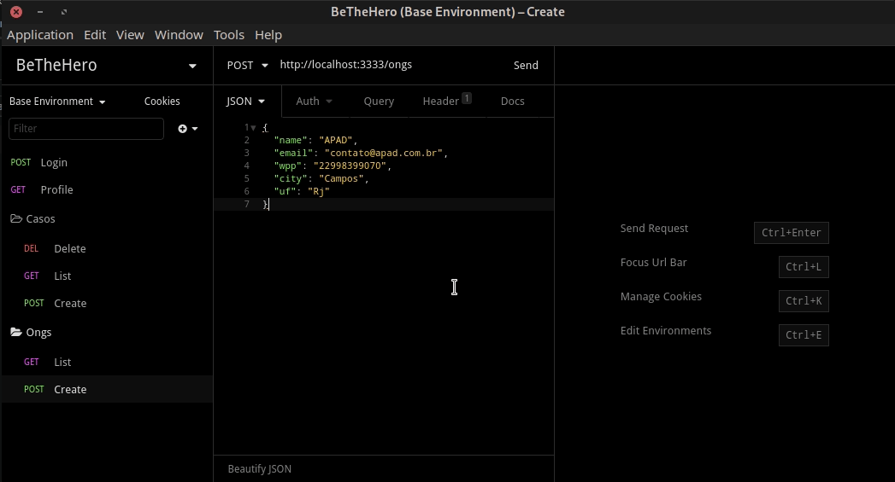
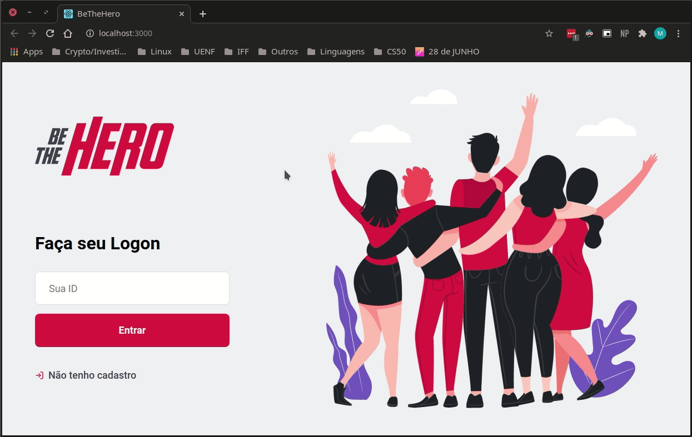

<h1 align="center">Welcome to BeTheHero 👋</h1>
<p>
  
  <a href="https://github.com/Mdsp9070/BeTheHero/blob/master/LICENSE" target="_blank">
    
  </a>
  <a href="https://twitter.com/matdsoupe" target="_blank">
    
  </a>
</p>

## Media

### API

<div align="center" width:"30%">
  
</div>

<br/>

### WEB

<div align="center" width:"30%">
  
</div>

## Description

BeTheHero was the project of Omnistack Week by [Rocketseat](https://rocketseat.com.br/). It aims to link NGOs to possible donators; is a place where NGOs can create cases with how much they need and donators can get in touch by Whatsapp or email.

The original project is found on the tar archive on this repository, however I made my version of this project. First, I wrote in TypeScript because it provides a better understanding of all code, TS code can easily be implemented and refactored.

I also changed from [express](https://www.npmjs.com/package/express) to [koa](https://www.npmjs.com/package/koa) on the grounds that koa is promise-bases and middleware orientated. However I got so many bugs with firebase functions, which only accepts express apps, so I rewrote with express to make funtion deploy. I also tried to reproduce this repository: [koa & firebase](https://github.com/tohagan/firebase-typescript-koa-starter) but no success.

My choice for database was [MongoDB](https://www.mongodb.com/) and I chose [Typegoose](https://www.npmjs.com/package/@typegoose/typegoose) in order to work better with my DB models and properties types.

### 🏠 [Project Live](https://bethehero-matts.web.app/)

## Install

```sh
yarn install
```

## Usage

```sh
yarn dev || yarn start
```

## Run tests

```sh
yarn test
```

## Author

👤 **Matheus <matheus_pessanha2001@outlook.com>**

- Twitter: [@matdsoupe](https://twitter.com/matdsoupe)
- Github: [@Mdsp9070](https://github.com/Mdsp9070)
- LinkedIn: [@mdsp](https://linkedin.com/in/mdsp)

## 🤝 Contributing

Contributions, issues and feature requests are welcome!<br />Feel free to check [issues page](https://github.com/Mdsp9070/BeTheHero/issues).

## Show your support

Give a ⭐️ if this project helped you!

## 📝 License

Copyright © 2020 [Matheus <matheus_pessanha2001@outlook.com>](https://github.com/Mdsp9070).<br />
This project is [Apache 2.0](https://github.com/Mdsp9070/BeTheHero/blob/master/LICENSE) licensed.

---

_This README was generated with ❤️ by [readme-md-generator](https://github.com/kefranabg/readme-md-generator)_
